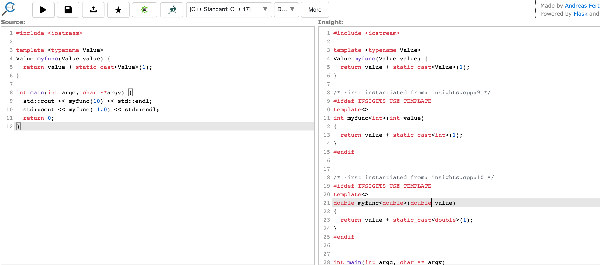

[TOC]

# 常量

​	C++支持两种不变式：

- const： 承诺不改变的变量，编译器会进行检查
- constexpr： 在编译时求值（也是个常量，不允许运行时修改）


# RAII

资源获取即初始化（Resource Acquisition Is Initialization，RAII）核心逻辑是：在类的构造函数中获取资源，在类的析构函数中释放资源。资源是一个很抽象的概念：free store的内存可以是资源、文件fd也是资源，一个锁也是资源。

RAII经常于智能指针一起使用，但是RAII与智能指针不是同一个概念。


# initializer_list 

标准库类型，当我们使用{}列表的时候，编译器会创建initializer_list类型。

```c++
#include <iostream>
#include <vector>
#include <initializer_list>
 
template <class T>
struct S {
    std::vector<T> v;
    S(std::initializer_list<T> l) : v(l) {
         std::cout << "constructed with a " << l.size() << "-element list\n";
    }
    void append(std::initializer_list<T> l) {
        v.insert(v.end(), l.begin(), l.end());
    }
    std::pair<const T*, std::size_t> c_arr() const {
        return {&v[0], v.size()};  // copy list-initialization in return statement
                                   // this is NOT a use of std::initializer_list
    }
};
 
template <typename T>
void templated_fn(T) {}
 
int main()
{
    S<int> s = {1, 2, 3, 4, 5}; // copy list-initialization
    s.append({6, 7, 8});      // list-initialization in function call
 
    std::cout << "The vector size is now " << s.c_arr().second << " ints:\n";
 
    for (auto n : s.v)
        std::cout << n << ' ';
    std::cout << '\n';
 
    std::cout << "Range-for over brace-init-list: \n";
 
    for (int x : {-1, -2, -3}) // the rule for auto makes this ranged-for work
        std::cout << x << ' ';
    std::cout << '\n';
 
    auto al = {10, 11, 12};   // special rule for auto
 
    std::cout << "The list bound to auto has size() = " << al.size() << '\n';
 
//    templated_fn({1, 2, 3}); // compiler error! "{1, 2, 3}" is not an expression,
                             // it has no type, and so T cannot be deduced
    templated_fn<std::initializer_list<int>>({1, 2, 3}); // OK
    templated_fn<std::vector<int>>({1, 2, 3});           // also OK
}
```


# using 和 typedef在定义别名上的区别

使用typedef

```C++
template <typename T> struct whatever {};

template <typename T> struct rebind
{
  typedef whatever<T> type; // to make it possible to substitue the whatever in future.
};

rebind<int>::type variable;

template <typename U> struct bar { typename rebind<U>::type _var_member; }
```


使用using：

```c++
template <typename T> using my_type = whatever<T>;

my_type<int> variable;
template <typename U> struct baz { my_type<U> _var_member; }
```


#  c++filt——根据函数的汇编名字转换成声明

```
> c++filt
_Z6myfuncIdET_S0_
double myfunc<double>(double)
```


# https://cppinsights.io/  一个神奇的网站

工具网页地址：https://cppinsights.io/

github源码地址: https://github.com/andreasfertig/cppinsights

可以拿到模板展开后的代码：



