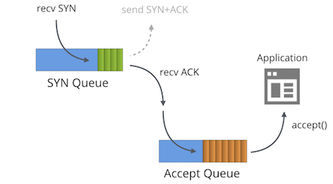

[TOC]

## 半连接队列和全连接队列

- 半连接队列（half open queue/SYN queue）：TCP监听的端口收到SYN包后，会把当前连接（五元组）放到半连接队列进行管理。半连接队列的长度是以一个监听的端口为粒度的，半连接队列的最大容量计算公式为：`max(tcp_max_syn_backlog, 64)`,其中tcp_max_syn_backlog为系统参数。

- 全连接队列（accept queue）：TCP三次握手成功后（收到最后一个由Client发来的ACK），从半连接队列取出请求放到全连接队列。值得注意的是，当应用层的accept()调用返回后，连接会从全连接队列中移除。因此accept queue当前长度并不能代表已经建立好（accepted）的连接。全连接队列的容量计算公式为：`min(net.core.somaxconn, backlog)`,其中net.core.somaxconn为系统参数，backlog是TCP连接监听时候的参数，如

  > int listen(int sockfd, int backlog);
  >
  > reThe  backlog  argument  defines  the maximum length to which the queue of pending connections for sockfd may grow.  If a connection request arrives when the queue is full, the client may receive an error with an indication of
  >        ECONNREFUSED or, if the underlying protocol supports retransmission, the request may be ignored so that a later reattempt at connection succeeds

- 查看系统参数的方式：`sysctl -a|grep tcp_max_syn_backlog`
- 队列满的表现和报错方式：
  - 半连接队列满了：
    - 当net.ipv4.tcp_syncookies=0时，SYN packet会被丢弃
    - 当net.ipv4.tcp_syncookies=1时
      - 如果全连接队列满了,SYN会被丢弃
      - 除上述情况外，生成SYN cookie并且返回SYN/ACK。
  - Server会丢弃当前连接， client 会收到connection time out；只要是 client 没有收到 SYN+ACK，3s 之后，client 会再次发送，如果依然没有收到，9s 之后会继续发送。
  - 全连接队列满后，收到ACK packet：
    - tcp_abort_on_overflow=1的情况：直接返回RST通知客户端，相应的收到read timeout 或者 connection reset by peer。
    - tcp_abort_on_overflow=0的情况：忽略收到的ACK包，继续让连接放在SYN Queue中，等到连接的定时器超时后会继续发送SYN/ACK包给客户端，客户端会继续发送ACK给服务端。重试的次数由参数net.ipv4.tcp_synack_retries决定。此外，当全连接队列满了之后，内核会限制请求放到SYN队列中的，因此新的请求发送SYN给服务端后，有可能SYN的packet会被丢弃，要依赖客户端重试发送SYN的机制。

- 队列的状态图：

  注意的是，即使三次握手完成了，也是需要应用层调用accept()把请求从Accept Queue中取出，Accept Queue里面的连接才会减1



- 观察方法：

  - 全连接队列的容量和当前的长度，通过如下方法就可以判断全连接队列是不是满了

    ```bash
    ss -anlt |grep -E "8080|State"
    State      Recv-Q Send-Q Local Address:Port               Peer Address:Port
    LISTEN     3      2      127.0.0.1:8080                     *:*
    ```

    其中，处于LISTEN状态的Socket中，Send-Q 的值为当前Socket的Accept Queue的容量，为2；Recv-Q的值为当前Accept Queue的长度，为3。这里的Accept Queue长度比容量还大1，表明在具体实现上是有出入的。

  - 半连接队列移除的报错信息，可以通过netstat工具查看

    ```bash
    netstat -s|grep overflow
        449 times the listen queue of a socket overflowed
    ```

  - 补充ESTAB状态的连接的Send-Q和Recv-Q的参数含义：

    Recv-Q代表还没拷贝到用户空间的数据字节数量。Send-Q代表发送到了对端，但是还没收到对端的ACK的数据字节数量。

    > Recv-Q
    >
    > Established: The count of bytes not copied by the user program connected to this socket.
    >
    > Listening: Since Kernel 2.6.18 this column contains the current syn backlog. （Accept queue）
    >
    >  
    >
    > Send-Q
    >
    > Established: The count of bytes not acknowledged by the remote host.
    >
    > Listening: Since Kernel 2.6.18 this column contains the maximum size of the syn backlog.


## 如何防御SYN FLOOD和SYN cookie的机制

- 减少SYN-ACK的重发次数：`sysctl -w net.ipv4.tcp_synack_retries=3`
- 使用SYN cookie的技术：`sysctl -w net.ipv4.tcp_syncookies=1`
- 增加backlog队列的长度，这个需要应用listen时候调整，也需要内核参数调整：`sysctl -w net.ipv4.tcp_max_syn_backlog=2048`
- 限制SYN的并发数，实际的数量需要视业务具体情况设置：`iptables -A INPUT -p tcp --syn -m limit --limit 1/s -j ACCEPT --limit 1/s`


SYN Cookie机制：SYN Cookie时对客户端透明的，只在服务端进行修改了。启动SYN Cookie后，服务端收到一个SYN请求，是不会把请求放到半连接上的，而是生成一个Cookie值作为SYN/ACK包的seq号（初始序列号）。当客户端收到SYN/ACK后，就会执行三次握手的最后一个阶段——返回ACK包，ACK包中的ack号就是服务器上一步返回给客户端的Cookie+1。当服务端收到最后一个ACK的时候，就会按照算法再次去计算Cookie值，Cookie值相等就认为是一个正常的连接。

因此，关键是cookie的计算过程，cookie的生成机制需要考虑：安全、性能、时效

- 计算公式是：mac = MAC(A, key)。MAC是密码学中的一个消息认证码函数，也就是满足某种安全性质的带密钥的hash函数，它能够提供mac计算中需要的安全性。在Linux实现中，MAC函数为SHA1。SHA1既能兼顾安全和性能。注意mac还不是最后的cookie

- key是一个服务器独有的密钥，是一组随机数。t是系统启动的时间，每60s加1，因此在网络环境不好的环境下，刚好跨越60s的界限的时候，有可能握手会失败。**MSSIND** 为**`MSS`**对应的索引。

- cookie生成还需要能够把握手第一个包的TCP相关参数保存下来，因此还需要额外的机制。具体怎么做，后续再深入。

  

## TCP参数调优

三个重要的参数需要调整，半连接队列容量、全连接队列容量和nf conntrack模块的流数量。建议值为：

> net.ipv4.tcp_max_syn_backlog = 8192 
>
> net.core.somaxconn = 4096 
>
> net.netfilter.nf_conntrack_max = 5000000

除了TCP的参数外，还需要增加文件描述符的数量上限。具体配置不在这里展开。