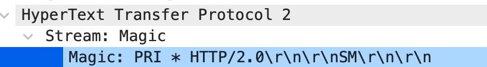
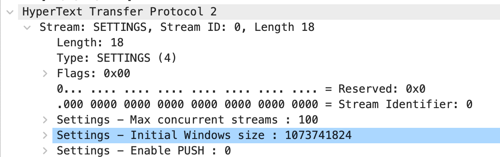
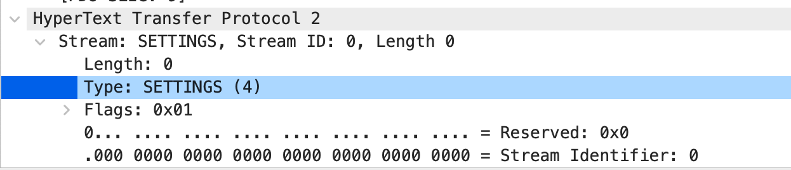
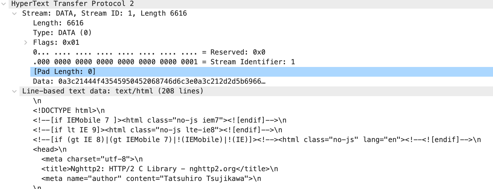

## 1. HTTP/2解决了什么问题？

要回答这个问题，首先要回答HTTP/1.1存在的问题（当然也包括HTTP/1.0）。

HTTP/1.1存在的问题有：


## 2. HTTP/2协议

HTTP/2协议在浏览器中必须是基于TLS/SSL戏诶咦的，但是IETF标准中并没要求必须基于TLS/SSL协议。因此，http2其实是可以基于http或者https的。http2的分类如下：

- h2: 基于TLS协议运行的HTTP/2
- h2c: 基于TCP协议之上运行的HTTP/2 

h2c的upgrade流程与升级websocket的流程相似。

首先看一下h2c的这种协议是怎么从HTTP/1.1升级上来的。因为浏览器只能用h2的协议，所以需要使用命令行工具来进行触发：

1. 执行：  `curl -http2 -v http://nghttp2.org`

   可以看到请求和响应中关键的信息有：

   ```http
   GET / HTTP/1.1
   Host: nghttp2.org
   User-Agent: curl/7.64.1
   Accept: */*
   Connection: Upgrade, HTTP2-Settings
   Upgrade: h2c
   HTTP2-Settings: AAMAAABkAARAAAAAAAIAAAAA
   
   HTTP/1.1 101 Switching Protocols
   Connection: Upgrade
   Upgrade: h2c
   ```

   其中，开始的请求还是HTTP/1.1协议的，但是请求中带上来关于协商升级的头部

   -  Connection: Upgrade, HTTP2-Settings
   - Upgrade: h2c (表示客户端支持的协议是h2c)
   - HTTP2-Settings：xxxx 一个随机数，后面再详细介绍

   服务器返回的响应中，就表示可以升级到h2c的模式，响应码为101。

2. 协商完成后，HTTP/2的请求还没开始建立的，需要客户端发送Preface请求。所谓的Preface请求就是发送一个魔术帧给服务端

   Preface发送的数据是：`0x505249202a20485454502f322e300d0a0d0a534d0d0a0d0a`

   

   

3. 客户端发送完Preface后，还需要发送SETTING帧。用于协商HTTP/2中使用的一些参数，如接受窗口、Stream的数量等

   

4. 服务端收到SETTING帧后，也需要往客户端发送一个SETTING帧

   

5. 经过上述流程后，HTTP/2的连接才真正建立起来了。

   