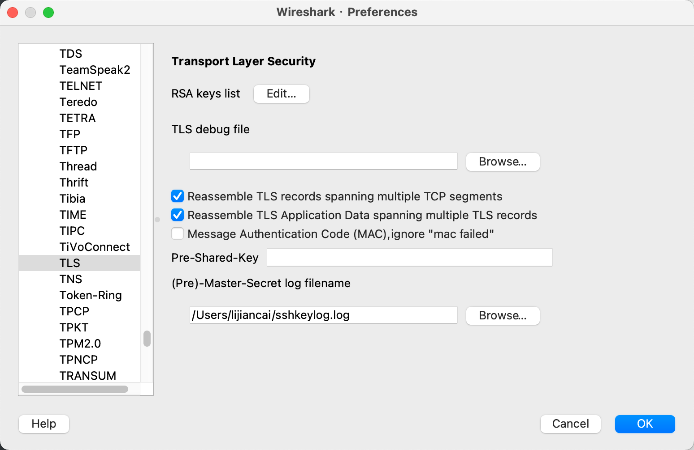
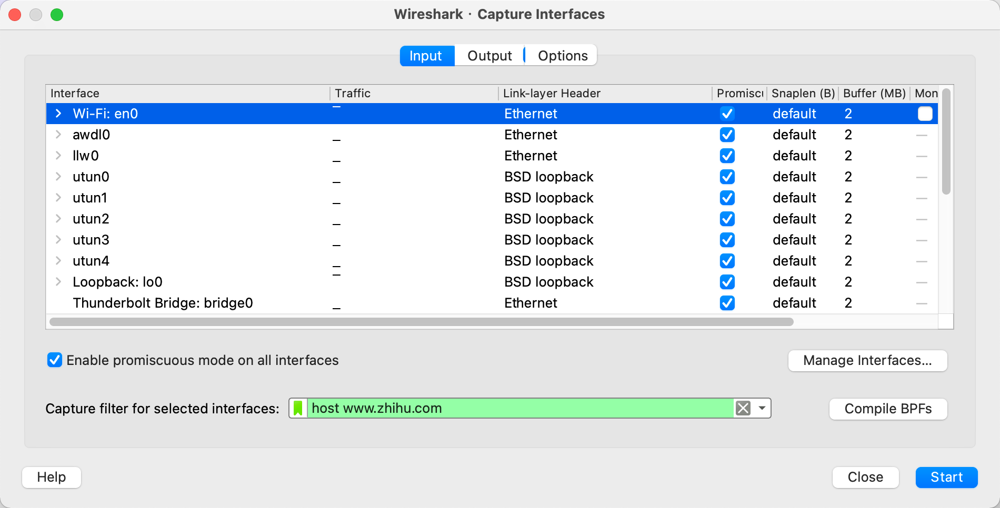
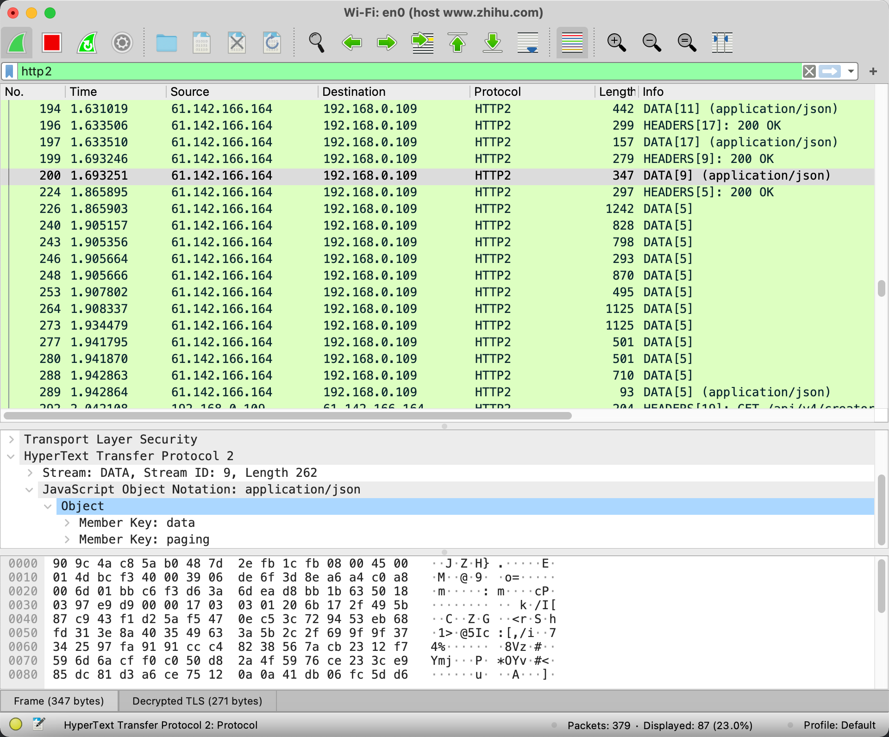

<!-- toc -->

[TOC]

## Mac 配置解密TLS流量

1. 在Home目录创建一个文件，用于TLS握手中间过程输出的关键数据：`touch sshkeylog.log`

2. export环境变量SSLKEYLOGFILE，这样浏览器的TLS握手信息才会输出：`export SSLKEYLOGFILE=/Users/lijiancai/sshkeylog.log`

3. 关闭浏览器，比如Chrome，然后重新打开：`open -a 'Google Chrome'`

4. 配置Wireshark，【Preferences】-> 【Protocols】-> 【TLS】-> 【(Pre)-Master-Secret】

   

## 演示效果

1. 演示抓知乎的数据包，首先这只捕获的参数:`host www.zhihu.com`

2. 过滤一下http2的流量出来，因为http2一定是使用TLS加密的

   我们可以看到原始的数据内容了

   