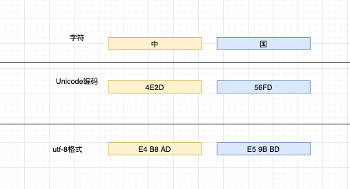
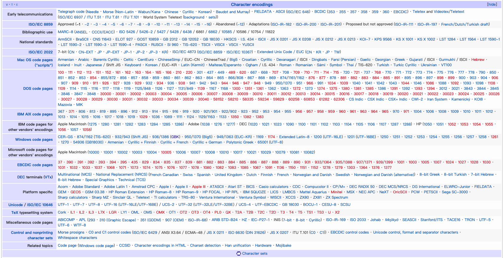
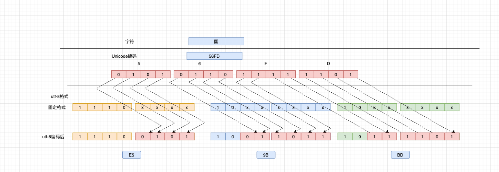

[TOC]

# 什么是Unicode

Unicode可以理解为字符集，由一个国际组织给每个字符分配一个编号（或者叫ID）。记住：Unicode只负责分配ID。

计算机只能保存0101的二进制格式的数据，所谓在一个字符保存到计算机中其实有两个步骤：

- 找到某个字符的Unicode字符编号
- 根据字符编号，选择响应的编码格式生成对应的二机制数据

举个例子：

Unicode字符集中，“中”的编码编号是4E2D，“国”的编码编号是56FD。但是编码编号相当于一个数字，怎么保存到计算机的存储设备上呢？这时候就是编码对应的存储格式的任务的，Unicode的存储格式有UTF-8、utf-16等存储格式。其中UTF-8的应用比较广泛，就以UTF-8 为例子：“中”的UTF-8格式是：E4B8AD。“国”的UTF-8格式是：E59BBD。 UTF-8是真正保存在计算机存储设备上的数据格式。



Unicode可以理解为一本字典，里面记录了每个字符的编号。至于这些编号怎么对应保存到计算机中呢？就是UTF-8把Unicode的编号转义后保存到计算机中去。因此，Unicode与uft-8不是同一个层次上的东西，UTF-8格式可以说是Unicode的一种实现方式而已。

因此，我们可以看到Unicode经常推出一些新的字符、表情（😊）等emoji，其实就是在做字符编码编号的事情，给每个字符一个ID。

资源链接：

- 中文的Unicode编码编号查询：http://www.chi2ko.com/tool/CJK.htm
- 中文的UTF-8格式查询：http://www.shabsin.com/~rshabsin/chineseutf8chars.html
- Unicode组织的官网：https://home.unicode.org/


编码格式全景图：




# ASCII

ASCII全称**American Standard Code for Information Interchange**，只有128个字符，从名字就能看出来，一开始设置的时候只考虑到了英文字符的编码，毕竟美帝128个字符就够用了。但是随着计算机技术的发展和普及，非英文语系国家使用就会出现字符编码的问题的。所以就出现了Unicode、GBK和GB2312这些编码格式。


ASCII编码表：


# UTF-8编码格式

UTF-8编码格式是一种变长的编码格式，从一个字节到四个字节不等，并且兼容ASCII格式，这也就是为什么UTF-8格式为什么这么流行和被这么多系统采用的原因。因为兼容ASCII，原来使用ASCII格式保存的数据，可以直接使用UTF-8格式的解码系统解码，并且不会增加原有文档的使用空间。如果UTF-8是定长的，比如四个字节，那么原来有ASCII保存的文件是1KB的，使用UTF-8编码后，占用的空间就需要4KB了。

现在我们来探讨一下UTF-8怎么实现变成编码和兼容ASCII格式的。编码规则有两条

- 1个字节的符号，字节第一位设置0。后面7位作为这个符号的Unicode码。因此，UTF-8就可以与ASCII兼容了
- 对于n个字节的符号（n>1&&n<=4)。第1个字节的前n位都是1，第n+1位是0。后面的n-1个字节的前两位都设置为10。剩余没有提及到的bit，为这个符号的Unicode码。

Unicode字符集和UTF-8编码的对应表格如下：


- Unicode编码是00到7F的，使用一个字节表示。所以0xxx xxxx中的x表示，x可以为0也可以为1，取决于这个编码是什么。
- Unicode编码是80到7FF的，使用2个字节表示。110x xxxx 10xx xxxx是固定的格式，剩余的11个x，表示只有11个bits用来填充Unicode
- Unicode编码是800到FFFF的，使用3个字节表示
- Unicode编码是10000到10FFFF的，使用4个字节表示。


“中”的Unicode编码是4E2D，“国”的Unicode编码是56FD，都需要使用3个字节表示。三个字节表示的UTF-8编码中，1110 xxxx 10xx xxxx 10xx xxxx都是固定的格式，剩余的x就需要使用Unicode的二进制( 国：101011011111101)，从最右边的x开始填充，如果不够就填Unicode的二进制编码0。下面以“国”字为例子，演示转换的过程





# 编码转换工具

- hexdump 

  ```bash
  1.  编写文件：编码例子.txt
  > cat 编码例子.txt
  中国
  
  2. 检查文件的类型，确定是UTF-8编码格式的
  > file 编码例子.txt
  编码例子.txt: UTF-8 Unicode text
  
  3. 查看文件内容：
  >  hexdump  编码例子.txt
  0000000 b8e4 e5ad bd9b 000a
  0000007
  
  4. hexdump -C参数输出：
  > hexdump -C  编码例子.txt
  00000000  e4 b8 ad e5 9b bd 0a                              |.......|
  00000007
  ```

  ​	hexdump输出解析：

  第一个字节：e4

  第二个字节：b8

  第三个字节：e5

  可以使用od命令验证：`od  编码例子.txt  -N 1 -H -j 1`


- 文件内容编码转换工具： iconv ,只把文件的内容进行了转换，并没有对文件名字进行转换

  ```bash
  uft-8转换成GBK
  > iconv -f utf-8 -t gbk 编码例子.txt  > output
  
  > file output
  output: ISO-8859 text
  
  GBK 转 utf-8
  > iconv -f gbk -t utf-8 output  > 编码例子.txt
  ```

  

- 对文件名字进行转换（不涉及内容的转换）

  ```
  > convmv -f utf-8 -t gbk --notest 编码例子.txt
  
  编码后，文件的名字乱码了。。
  
  ????????.txt
  
  > 转换回来 convmv -f gbk -t utf-8 --notest ????????.txt
  ```

  